# INTEGRANTES
- **Kaique Rodrigues Zaffarani** (RM: 556677) 
- **Guilherme Santos Nunes** (RM: 558989)
- **Henry Evideira Paulo** (RM: 554985)
  

## LINKS
- **[SIMULADOR 1](https://wokwi.com/projects/400327781735471105)**  
- **[SIMULADOR 2](https://wokwi.com/projects/400327855929569281)**  
  
- **[VÍDEO EXPLICATIVO](https://drive.google.com/file/d/1Aj_cC1QACjrZxEltwA77N0MsVcR4OIxI/view?usp=sharing)**

## SOBRE O PROJETO
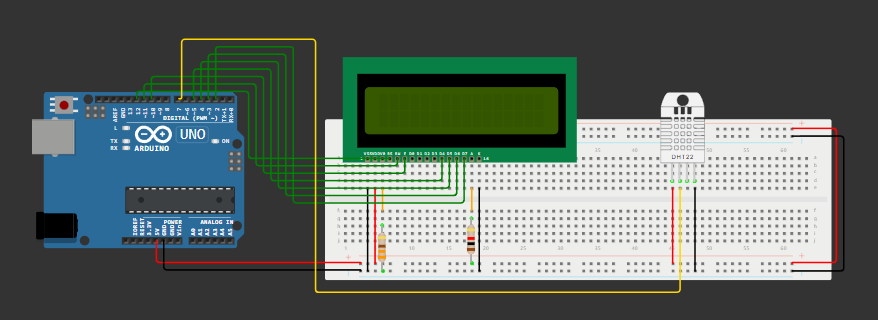
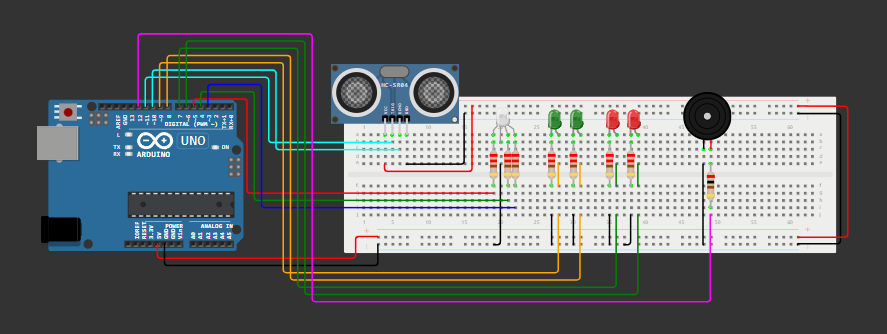

A **[Tech Mahindra](https://www.techmahindra.com)**, em parceria com a **[FIAP](https://www.fiap.com.br)**, busca popularizar a **Fórmula E** por meio de soluções tecnológicas práticas e interativas. Portanto, elaboramos simuladores que se encaixam nesses quesitos, destinados às competições de **Fórmula E** através da análise de dados, display de informações relevantes e ativação de componentes.

## INSTRUÇÕES DE USO - SIMULADOR 1
O **simulador 1** tem um sistema que, de acordo com a temperatura e umidade do ambiente, recomenda diferentes estratégias competitivas a serem aderidas por um piloto de Fórmula E durante uma corrida. Ou seja, dependendo das condições climáticas, informações específicas são transmitidas em um display.

**Exemplo:** em caso de clima quente com pouca umidade, no display, aparecerão mensagens que recomendam a hidratação do piloto e a ativação do sistema de ventilação do seu carro.

- **CÓDIGOS FUNDAMENTAIS:**  
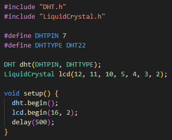  
*Aqui se encontram os códigos preparatórios, que permitem a inclusão das bibliotecas, definição de portas de entrada e inicialização dos sensores. Vale destacar que existe um pequeno atraso de 500 milissegundos na inicialização a fim de evitar conflitos com funções subsequentes.*
 
 

- **DHT22:**  
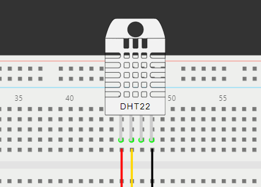  
*O sensor DHT22 é o responsável por medir temperatura e umidade do ambiente, permitindo alterar essas medidas na simulação ao clicar diretamente nele com o mouse.*
 
 

- **LCD (LIQUID CRYSTAL DISPLAY):**  
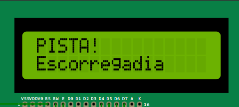  
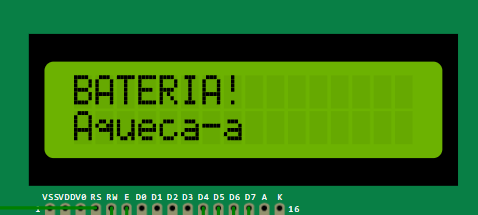  
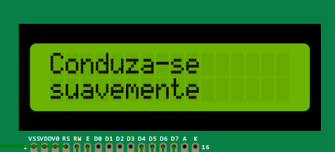  
*Dependendo da regulagem de temperatura e umidade no sensor DHT22, mensagens de recomendações estratégicas voltadas a Fórmula E que respeitam a condição climática ocasionalmente estabelecida são transmitidas na tela do LCD. Vale experimentar variadas regulagens.*
 
 

- **PERSONALIZAÇÃO:** 
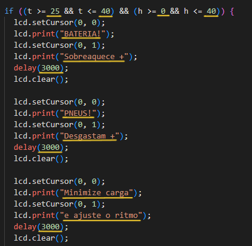  
*Para alterar as funções **If**, **Else If** e **Else** do código para que lhe convenha, "t" representa a temperatura em graus Celsius (°C) e "h", a umidade em porcentagem (%). As mensagens estão sublinhadas em amarelo e o "delay()" é a pausa entre a transmissão de uma mensagem para outra em milissegundos.*

## INSTRUÇÕES DE USO - SIMULADOR 2
O **simulador 2** apresenta um sistema capaz de medir a distância que se encontra de um objeto à sua frente. Dependendo da distância, um LED RGB é ligado (altera seus níveis mudando a coloração), diferentes outros LEDs são ligados e um buzzer é acionado ou não.

- **CÓDIGOS FUNDAMENTAIS:**  
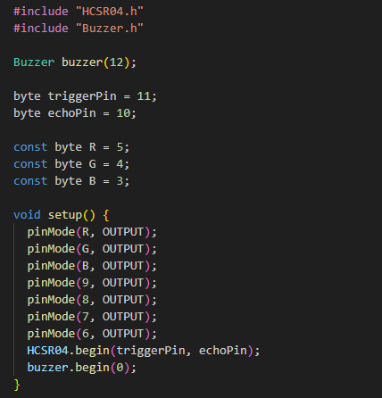  
*Assim como no **simulador 1**, aqui se encontra o código de inclusão de bibliotecas. No mais, observa-se sintaxes personalizadas das bibliotecas "Buzzer.h" e "HCSR04.h" (que declaram os pinos que conectam os sensores), variáveis constantes e, na função de inicialização, códigos de ativação dos sensores mais declarações de LEDs em respectivos pinos.*
 
 

- **HC-SR04:**  
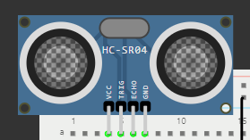  
*O sensor HC-SR04 exerce a tarefa de medir distâncias emitindo pulsos ultrassônicos que são refletidos por obstáculos e que retornam ao seu módulo. Para utilizá-lo na simulação, basta clicar diretamente nele com o mouse.*
 
 

- **LEDS & BUZZER:**  
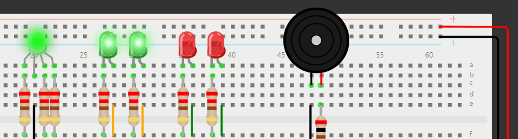  
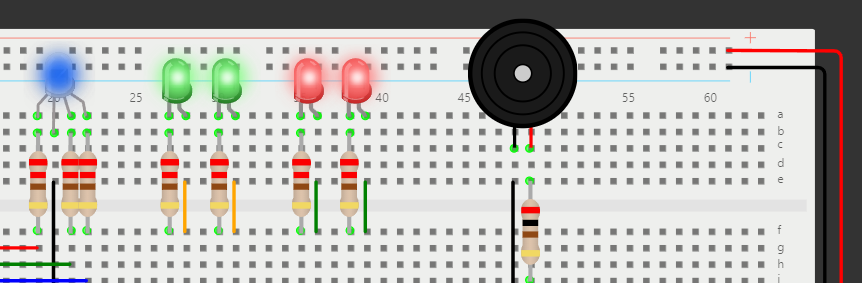  
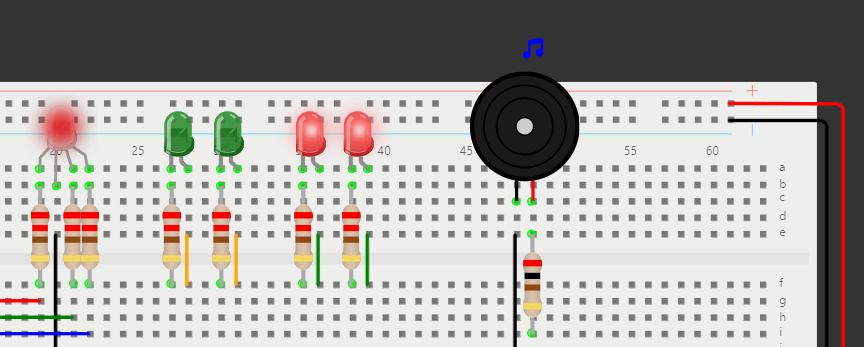  
*Conforme a distância é setada no sensor HC-SR04, o padrão de ativação dos LEDs se altera. Caso a distância esteja entre 200cm e 300cm, o buzzer é acionado (tocando 3 bipes intervalados).*
 
 

- **PERSONALIZAÇÃO:** 
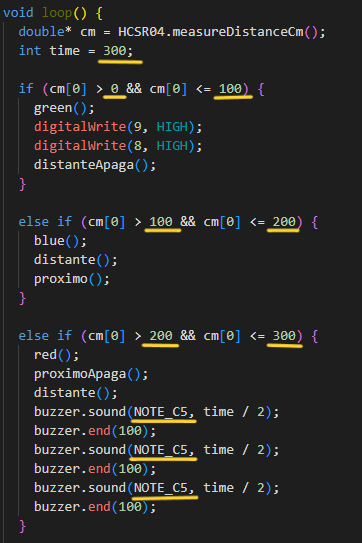  
*Para alterar valores nessa área do código, é importante saber que, dentro da função "Loop()", "int time =" representa o tempo de duração de um bipe do buzzer, "cm[0] significa a distância em centímetros (cm) e o "buzzer.sound()" permite ajustar a tonalidade do bipe desejado (No caso, toca-se a nota Dó na quinta oitava).*

## REQUISITOS
Para a implementação e execução dos códigos dos **simuladores** (localizados na pasta: **src**) no Arduino IDE, a prévia instalação das bibliotecas dos sensores (localizadas na pasta: **libraries**) é necessária. Em caso de dúvida, segue instruções de instalação mais precisas:

- **[INSTALAÇÃO DE BIBLIOTECAS NO ARDUINO IDE](https://docs.arduino.cc/software/ide-v1/tutorials/installing-libraries/)**
- **[INSTALAÇÃO DO ARDUINO IDE](https://www.arduino.cc/en/software)**
 
 

Para a construção do **simulador 1**, serão necessários:

- **1x** Cabo USB para Arduino Uno - **R$12,00**
- **1x** Arduino Uno R3 [(Documentação)](https://docs.arduino.cc/hardware/uno-rev3/) - **R$50,00**
- **1x** LCD (Liquid Crystal Display) 16x2 [(Documentação)](https://docs.arduino.cc/learn/electronics/lcd-displays/) - **R$20,00**
- **1x** Sensor de temperatura e umidade DHT22 [(Documentação)](https://cityos-air.readme.io/docs/4-dht22-digital-temperature-humidity-sensor) - **R$30,00**
- **1x** Resistor de 330 Ω (ohms) - **R$2,00**
- **1x** Resistor de 1 kΩ - **R$2,00**
- **1x** Placa de ensaio (de preferência com 830 pontos) - **R$20,00**
- **19x** Cabos Jumper macho-macho (contados com a placa de ensaio incluída) - **R$13,00**
- **TOTAL - R$149,00**
 
 

Para a construção do **simulador 2**, serão necessários:

- **1x** Cabo USB para Arduino Uno - **R$12,00**
- **1x** Arduino Uno R3 [(Documentação)](https://docs.arduino.cc/hardware/uno-rev3/) - **R$50,00**
- **1x** Sensor de distância ultrassônico HC-SR04 [(Documentação)](https://web.eece.maine.edu/zhu/book/lab/HC-SR04%20User%20Manual.pdf) - **R$13,00**
- **1x** Piezoeletric buzzer ativo de 5V [(Documentação)](https://wiki-content.arduino.cc/documents/datasheets/PIEZO-PKM22EPPH4001-BO.pdf) - **R$4,00**
- **1x** LED RGB de alto brilho de 5mm (Catodo comum) - **R$1,00**
- **2x** LED verde difuso de 5mm - **R$0,50**
- **2x** LED vermelho difuso de 5mm - **R$0,50**
- **7x** Resistor de 220 Ω (ohms) - **R$14,00**
- **1x** Resistor de 200 Ω - **R$2,00**
- **1x** Placa de ensaio (de preferência com 830 pontos) - **R$20,00**
- **26x** Cabos Jumper macho-macho (contados com a placa de ensaio incluída) - **R$13,00**
- **TOTAL - R$130,00**

## IMPLEMENTAÇÃO
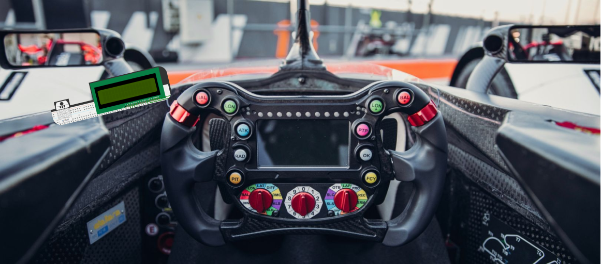  
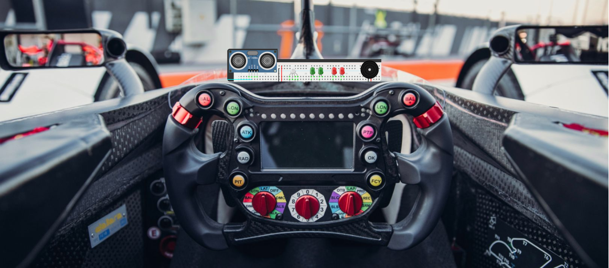  
*Pensamos em instalar os simuladores nos cockpits dos carros da Fórmula E, mais especificamente em áreas próximas ao console para que o piloto visualize-os e usufrua ao seu favor. A parte de cabeamento do **simulador 1** se encontraria na lateral interna esquerda, enquanto a do **simulador 2**, na frente interna (Ambos não acompanhariam placa de ensaio). Para energizá-los, utilizaria-se da bateria do próprio carro, já que ambos se tratam de ferramentas estratégicas. Assim, uma maior competição, interação e imersão durante as corridas será proporcionada.*

## OBSERVAÇÕES
Os **simuladores** devem ser utilizados para propósitos experimentais! Não recomendamos o uso dos mesmos em projetos profissionais. Ademais, não nos responsabilizamos por eventuais danos.

Os preços dos componentes estão aproximados e foram registrados no dia **12/06/2024**. Os componentes estão sujeitos a valorização ou desvalorização.

O subtópico "PERSONALIZAÇÃO" mostra sugestões de modificação para aqueles com pouco conhecimento em codificação Arduino experimentar sem afetar o código-fonte. Se não é o seu caso, não é necessário limitar-se em alterar apenas o que foi sublinhado de amarelo nas imagens. 

As bibliotecas escolhidas têm recursos ainda mais complexos a serem adicionados. Caso deseje explorá-las ainda mais, consulte-as (localizadas na pasta: **libraries**) ou pesquise por similares. O que vale é aprender. 

## REFERÊNCIAS
- **[Automobilismo: no calor da competição](https://www.scielo.br/j/rbme/a/W8xc8KzkZp74PJLNrmB7qpc/)**
- **[O EFEITO DA SUPERFÍCIE DA PISTA NA ESTRATÉGIA DE CORRIDA](https://www.catapult.com/pt/blog/estrategia-de-corrida-superficie-da-pista-f1)**
- **[Os Tipos de Clima no Automobilismo: Estratégias e Pneus Usados em Condições Extremas](https://friendauthor.com/os-tipos-climaticos-no-automobilismo-estrategias-e-pneus-em-condicoes-extremas/)**
- **[Why Formula E Races Are So Exciting](https://www.fiaformulae.com/fr/news/6898/why-formula-e-races-are-so-excening)**
- **[Porque a Fórmula E é mais competitiva que a F1?](https://canaltech.com.br/carros/porque-a-formula-e-e-mais-competitiva-que-a-f1-282849/)**
- **[Como conectar o Sensor Ultrassônico HC-SR04 ao Arduino](https://www.makerhero.com/blog/sensor-ultrassonico-hc-sr04-ao-arduino/#:~:text=O%20funcionamento%20do%20HC-SR04,sensor%20e%20o%20objeto%20detectado.)**
